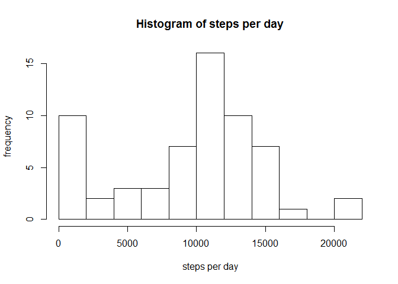
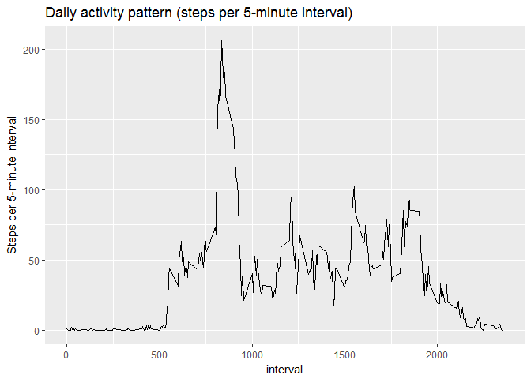
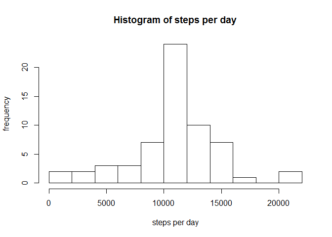
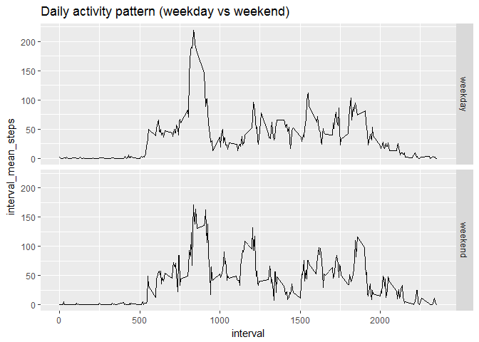

# Activity Tracking Analysis
Eric Thompson  
May 1, 2017  

## Reading and processing the data
After downloading the activity.csv file from the github repository (https://github.com/rdpeng/RepData_PeerAssessment1)
and then saving the activity.csv file in the working directory, we read the
data into R and load the **dplyr** and **ggplot2** packages.  

Very little pre-processing work is needed.  We simply convert the date variable to the "date"" class (from the "factor"" class), and we are ready to begin analyzing the data.


```r
# Loading packages and reading in data
data <- read.csv("activity.csv")
data$date <- as.Date(data$date)
library(dplyr)
library(ggplot2)
```

## Total number of steps per day
First we calculate the total number of steps per day and plot a histogram of it. We also calculate the mean and median.


```r
df1 <-
        data %>%
        group_by(date) %>%
        summarize(daily_total_steps = sum(steps, na.rm = TRUE))
hist(df1$daily_total_steps, breaks = 10, 
         main = "Histogram of steps per day",
        xlab = "steps per day",
        ylab = "frequency")
```

<!-- -->

```r
mean(df1$daily_total_steps)
```

```
## [1] 9354.23
```

```r
median(df1$daily_total_steps)
```

```
## [1] 10395
```

```r
# The mean daily_total_steps is 9,354.23.
# The median daily_total_steps is 10,395.
```

## Time series plot of the average number of steps taken
Next we plot the daily activity pattern and find the interval which has the highest
average daily step count.


```r
# Daily activity pattern
df2 <- data %>%
        group_by(interval) %>%
        summarize(interval_mean_steps = mean(steps, na.rm = TRUE))
ggplot(df2, aes(interval, interval_mean_steps)) +
        geom_line() +
        labs(title = "Daily activity pattern (steps per 5-minute interval)",
        y = "Steps per 5-minute interval")
```

<!-- -->

```r
max(df2$interval_mean_steps)
```

```
## [1] 206.1698
```

```r
df2[which(df2$interval_mean_steps == max(df2$interval_mean_steps)), ]
```

```
## # A tibble: 1 × 2
##   interval interval_mean_steps
##      <int>               <dbl>
## 1      835            206.1698
```

```r
# So, the interval = 835 has the maximum number of average steps (~206.17).
```

## Imputing missing data
Next we impute the missing values.  To do this, we subtitute any missing values for
the mean number of steps for that particular interval.  We then create a dataframe identical to the original "data" dataframe, except it has imputed step values
instead of missing data.


```r
# We do a left_join on steps per interval, where x = data and y = df2.
colnames(df2) <- c("interval", "steps")
joined_steps <- left_join(x = data, y = df2, by = "interval") 
for(i in 1:length(joined_steps$steps.x)) {
        if(is.na(joined_steps$steps.x[i] == TRUE)) {
                joined_steps$steps.x[i] <- joined_steps$steps.y[i]
        }
}
# We have successfully imputed the missing values in data$steps.  
# We imputed based on the average number of steps per five-minute 
# interval.  Now we create the new dataframe:
data_imputed <- joined_steps[, 1:3]
names(data_imputed) <- c("steps", "date", "interval")
```

## Histogram of steps taken each day after imputation
Next we make a histogram of total steps per day, similar to before.  This time, however, we are using the imputed values rather than the missing values.  We calculate the mean and median of total steps per day using the imputed data.  We compare those statistics with the same for the un-imputed dataframe.


```r
# We make a histogram of daily total steps per day.  (Same exercise as before.)
# But we want to see the impact of imputing the missing values.
# First we need to sum the daily totals again.
df1_imputed <-
        data_imputed %>%
        group_by(date) %>%
        summarize(daily_total_steps = sum(steps, na.rm = TRUE))
hist(df1_imputed$daily_total_steps, breaks = 10, 
        main = "Histogram of steps per day",
        xlab = "steps per day",
        ylab = "frequency")
```

<!-- -->

```r
mean(df1_imputed$daily_total_steps)
```

```
## [1] 10766.19
```

```r
median(df1_imputed$daily_total_steps)
```

```
## [1] 10766.19
```

```r
# The imputed mean daily_total_steps is 10,766.19. 
# (The non-imputed mean was 9,354.23.)
# The imputed median daily_total_steps is also 10,766.19. 
# (The non-imputed median was 10,395.)

# So the mean and median increase after we impute the step counts. 
# The difference is larger for the mean.
```

## Panel plot comparing weekday and weekend activity
Finally, we want to see if we can detect an activity pattern difference between weekdays and weekends.  We create the factor variable "day", which is equal to "weekday" for any day that is Mon-Fri, and is equal to "weekend" for Saturday or Sunday.


```r
# Any activity pattern difference between weekdays and weekends?
# First we create a factor variable for "weekday" versus "weekend"
data_imputed$date <- as.POSIXct(data_imputed$date)
data_imputed <- data_imputed %>%
        mutate(day = weekdays(date))
weekdays <- c("Monday", "Tuesday", "Wednesday", "Thursday", "Friday")
weekend_days <- c("Saturday", "Sunday")
for (i in 1:length(data_imputed$day)) {
        if(data_imputed$day[i] %in% weekdays) 
        {data_imputed$day[i] = "weekday"}
        else if(data_imputed$day[i] %in% weekend_days) 
        {data_imputed$day [i] = "weekend"}
}
# Next we make the table "df2_imputed" showing mean steps per interval 
# (based on data_imputed).  
df2_imputed <- data_imputed %>%
        group_by(day, interval) %>%
        summarize(interval_mean_steps = mean(steps, na.rm = TRUE))
ggplot(df2_imputed, aes(x = interval, y = interval_mean_steps)) + 
        geom_line() +
        facet_grid(day ~ .) +
        labs(title = "Daily activity pattern (weekday vs weekend)")
```

<!-- -->

